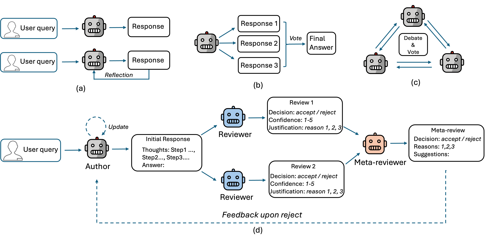

# ✨ MARS: Toward More Efficient Multi-Agent Collaboration for LLM Reasoning

This repository provides the necessary scripts and examples to run the **MARS** pipeline and reproduce the experimental results from our paper: [**MARS: toward more efficient multi-agent collaboration for LLM reasoning**](https://arxiv.org/abs/2509.20502) .

---

## 📘 Introduction

<p align="center">
  
</p>

**Figure:** Overview of **MARS** (Multi-Agent Review System). MARS is an efficient multi-agent collaboration framework for LLM reasoning. The framework proceeds in four main steps:  
1. **Author response** – an author agent generates an initial response to the user query.  
2. **Review** – multiple reviewer agents independently analyze the author’s response, identify potential issues, and provide structured comments.  
3. **Meta-Review** – a meta-reviewer aggregates the reviewers’ feedback, reconciles disagreements, and make the final decision. For a rejected response, the meta-reviewer will provide structured feedback and suggestions for answer revision.
4. **Rebuttal** - upon a rejected meta-decision, the author agent will update its initial answer by following the feedback from the meta-reviewer.   

This pipeline provides a new paradigm for multi-agent-based reasoning. It achieves comparable performance to MAD (Multi-Agent Debate) while reducing token consumption and inference time by ~50%.

---

## 🚀 Usage

This section walks through how to run the core functionalities of MARS.

---

### 🧰 Prerequisites

Clone the repo and install dependencies:

```bash
git clone https://github.com/xwang97/MARS.git
cd MARS
pip install -r requirements.txt
```

Configure the backend LLMs by editing `config.yml` (default: all use GPT-3.5 Turbo):

```yaml
author_llm: "gpt-3.5-turbo"
reviewer_llms:
  - "gpt-3.5-turbo"
  - "gpt-3.5-turbo"
  - "gpt-3.5-turbo"
meta_llm: "gpt-3.5-turbo"
```

🔐 **API Keys:** Store API keys in `.txt` files outside the repo:

- For OpenAI: `openai_api_key.txt`
- For NVIDIA NIM: `nvidia_api_key.txt`  
  (see [NVIDIA NIM API](https://build.nvidia.com/models))

---

### 🧪 Quick Example

Run the full MARS pipeline from a Python terminal:

```python
from pipelines import PipelineRunner

runner = PipelineRunner(task="gpqa")
review_history = runner.run_mars_pipeline(user_query="What is 9 × 7?", n_reviewers=2, verbosity=1)

response = review_history['author_response'] if 'author_rebuttal' not in review_history else review_history['author_rebuttal']
```

#### 📌 Parameters

| Name         | Description |
|--------------|-------------|
| `task`       | Dataset/task name. Choose from:<br>🧮 `"gsm"` → math data<br>📚 `"mmlu"`, `"gpqa"` → multi-choice QA |
| `question`   | The input question (just the raw question text — no prompt formatting needed). |
| `n_reviewers`| Number of reviewers (recommended: 2 or 3; default: 2). |
| `verbosity`  | Set to `1` to print step-by-step output; default is `0`. |

#### 📤 Output

- **`response`**: The final answer (initial author response or rebuttal).
- **`review_history`**: A dictionary containing all intermediate steps:
  - `author_response`, `review1`, `review2`, ..., `meta_review`, `author_rebuttal` (if applicable).

---

### 📈 Evaluation

You can reproduce all experiments from the paper using `evaluation.py`. For example:

```python
from evaluation import eval_marvel

multi_score, _, avg_tokens, avg_time = eval_mars(
    task="gpqa",
    n_problems=100,
    n_reviewers=2,
    selected=True
)
```

This evaluates MARS on the [GPQA dataset](https://github.com/idavidrein/gpqa).

#### 📌 Parameters

| Name          | Description |
|---------------|-------------|
| `task`        | Same as in `PipelineRunner`. |
| `n_problems`  | Number of test questions (due to cost, we recommend a subset). |
| `n_reviewers` | Number of reviewers (2 or 3). |
| `selected`    | If `True`, uses a saved question list for reproducibility. Set `False` on first run to generate and save one automatically. |

#### 📤 Output

- `multi_score`: Number of correct final answers.
- `avg_tokens`: Average tokens consumed per question.
- `avg_time`: Average inference time per question.
